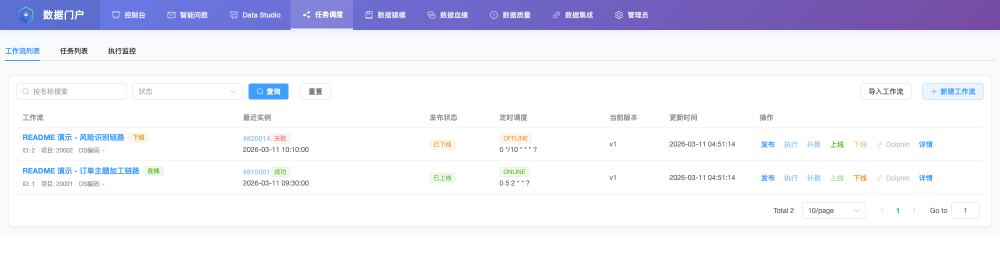

# OpenDataWorks

<p align="center">
  <picture>
    <source media="(prefers-color-scheme: dark)" srcset="frontend/public/opendataworks-icon-dark.svg">
    
  </picture>
</p>

<div align="center">

<p align="center">
  <a href="https://github.com/MingkeVan/opendataworks/stargazers"></a>
  <a href="https://github.com/MingkeVan/opendataworks/network/members"></a>
  <a href="https://github.com/MingkeVan/opendataworks/pulls"></a>
  <a href="https://github.com/MingkeVan/opendataworks/issues"></a>
  <a href="https://github.com/MingkeVan/opendataworks/blob/main/LICENSE"></a>
  <a href="https://github.com/MingkeVan/opendataworks/releases"></a>
  <a href="https://deepwiki.com/MingkeVan/opendataworks"></a>
  <a href="https://opendataworkshq.slack.com/"></a>
</p>

**一站式数据任务管理、智能问数与数据血缘可视化平台。**

[English](README.md) | 简体中文

[项目主页](https://mingkevan.github.io/opendataworks/) · [快速开始](docs/guide/start/quick-start.md) · [功能特性](docs/guide/manual/features.md) · [架构设计](docs/guide/architecture/design.md) · [配置说明](docs/guide/configuration/index.md) · [贡献指南](docs/guide/contribution/guide.md) · [Slack 社区](https://opendataworkshq.slack.com/)

</div>

---

## 项目简介

OpenDataWorks 是一个面向数据平台团队的开源统一数据门户，提供元数据管理、工作流编排、血缘分析和自然语言智能问数能力。

项目提供可直接部署的全栈实现：Java 后端、Vue 前端、用于智能问数的 Python DataAgent 服务，以及覆盖本地开发和生产部署的 Docker Compose 配置。

## 核心价值

- **统一数据资产管理**：集中管理表元数据、数据域、业务域和分层数据模型。
- **工作流编排**：可视化配置批处理和流处理任务，并深度集成 DolphinScheduler。
- **数据血缘分析**：自动解析 SQL 血缘，在交互式图谱中查看上下游链路。
- **智能问数**：在主门户内通过自然语言生成 SQL、执行分析并查看结果。
- **快速部署**：通过现有 Docker Compose 一次性拉起前端、后端、DataAgent Backend、Redis、MySQL 和 Portal MCP。

## 功能亮点

- ODS、DWD、DIM、DWS、ADS 分层元数据管理
- 工作流创建、发布、调度和执行监控
- SQL 与 Shell 任务支持
- 基于 ECharts 的数据血缘可视化
- Data Studio：目录浏览、SQL 编辑、表级元数据联动分析
- 内置 NL2SQL 智能问数入口
- 运行日志、历史记录与统计分析

## 项目演示

[https://opendataworks-demo.vercel.app](https://opendataworks-demo.vercel.app)

## 界面预览

### 任务调度



工作流列表、发布状态与常用操作入口。

### 数据血缘


围绕中心表查看上下游链路与层级关系。

### Data Studio


目录浏览、SQL 编辑与表级元数据联动分析。

## Docker 部署

### 开发环境快速启动

如果希望一次性在本机拉起完整环境（前端、后端、DataAgent Backend、Redis、MySQL、Portal MCP），可使用开发环境 Compose：

```bash
# 1. 准备配置
cp deploy/.env.example deploy/.env

# 2. 拉取最新镜像
docker compose -f deploy/docker-compose.dev.yml pull

# 3. 启动服务
docker compose -f deploy/docker-compose.dev.yml up -d

# 访问地址
# 前端: http://localhost:8081
# 后端: http://localhost:8080/api
# DataAgent Backend: http://localhost:8900
# Portal MCP: http://localhost:8801/mcp
```

### 生产环境与离线部署

请参考 [部署文档](deploy/README.md) 获取生产环境部署和离线包制作指南。

## 快速开始

请参考 [快速开始指南](docs/guide/start/quick-start.md) 部署并启动 OpenDataWorks。

## 文档

详细文档请查看 [docs/](docs/) 目录：

- [快速开始](docs/guide/start/quick-start.md)
- [架构设计](docs/guide/architecture/design.md)
- [配置说明](docs/guide/configuration/index.md)
- [常见问题](docs/guide/faq/faq.md)

## 社区

- 加入 [OpenDataWorks Slack 社区](https://opendataworkshq.slack.com/)，交流使用经验、部署问题、路线图想法和贡献计划。
- 如需反馈 Bug、提出功能建议或改进文档，请提交 [GitHub Issue](https://github.com/MingkeVan/opendataworks/issues)。

## 贡献

欢迎提交 PR 或 Issue。开始前请阅读 [贡献指南](docs/guide/contribution/guide.md)。

## 许可证

本项目采用 [GNU General Public License v3.0 only](LICENSE) 开源协议。
