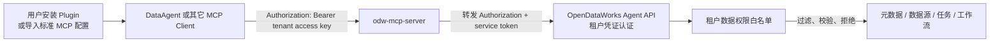

# DataAgent 与 OpenDataWorks 解耦设计

**Date:** 2026-09-14
**Goal:** 将 DataAgent 收敛为不感知 OpenDataWorks 的通用智能体平台，并把 OpenDataWorks MCP、租户身份、数据权限白名单与权限执行完整下沉到 OpenDataWorks 平台。
**Tech Stack:** DataAgent FastAPI / Vue 3 / Pi 与 Claude runtime；OpenDataWorks Java 8 / Spring Boot 2.7 / MySQL / Vue 3；Python FastMCP；Docker Compose。

> 本文是 DataAgent 与 OpenDataWorks 整体解耦的目标设计。与本文冲突时，本文取代
> `2026-03-20-portal-mcp-design.md` 中“DataAgent 默认 MCP-first”、
> `2026-05-22-agent-data-scope-design.md` 中“DataAgent 持有并透传数据范围”、
> `2026-09-11-dataagent-mcp-provider-registry-design.md` 中 `portal` 特殊分支，以及
> `2026-09-14-agent-data-scope-decoupling-design.md` 中仍由 DataAgent 管理平台数据范围的方案。
> 本文只定义目标架构、契约与迁移边界，不包含实施任务清单。

## Scope

本设计覆盖：

- DataAgent 基础提示词、内置智能体、内置 Skill、MCP 注册与运行时中的 OpenDataWorks 专属逻辑清理；
- `dataagent/portal-mcp/` 移入顶级 `odw-mcp-servers/`，服务重命名为 `odw-mcp-server`；
- OpenDataWorks 专属 Skill、MCP server 与可安装 Plugin 分别归入顶级 `odw-skills/`、`odw-mcp-servers/`、`odw-plugins/`；
- Portal MCP 的服务名、包名、镜像名、环境变量和工具名前缀统一改为 OpenDataWorks 所有的 `odw` 命名；
- DataAgent 不再自动注册、默认选择或特殊处理 OpenDataWorks MCP，用户通过标准 Plugin 安装或 MCP/Skill 单独导入能力；
- 从 DataAgent agent profile 中移除 `data_scope`，不再把范围写入提示词、任务快照、环境变量或 MCP Header；
- OpenDataWorks 用租户保存静态 Key，用租户与数据源/schema/表的白名单关系保存数据权限，并在 Java 平台边界统一强制执行；
- 平台登录用户通过 `platform_users.tenant_id` 绑定租户，与 MCP/API Key 调用复用同一份数据权限；
- 根部署、镜像构建、离线包、文档和测试的所有权调整；
- OpenDataWorks 作为 DataAgent 的一个可选外部集成，而不是 DataAgent 的内置依赖。

本设计不覆盖：

- 合并或替换 `dataagent/` 与 `opendataagent/` 两条产品线；
- 在本次设计中实现字段级、行级脱敏或 ABAC 表达式；第一版白名单支持 schema 级和表级授权；
- 让 DataAgent 理解 OpenDataWorks 的租户、用户、数据库或业务对象；
- 把 OpenDataWorks 业务知识重新写回 DataAgent 的通用系统提示词；
- OAuth、JWT、授权码登录或 token exchange；第一版每个租户只使用一把可替换的静态 API Key；
- 同一租户内再按平台用户配置不同数据权限；第一版 tenant 就是共享的数据安全边界；
- 改变主门户通过公开 widget 契约嵌入 DataAgent 的能力。该集成可以保留，但必须是可配置的消费关系。

## Current State

当前代码中的耦合不是单一目录问题，而是贯穿启动、配置、提示词、工具、权限和部署：

1. `dataagent/portal-mcp/` 位于 DataAgent 目录下，包名为 `portal_mcp`，服务、镜像、容器和环境变量均使用 `portal-mcp` / `PORTAL_MCP_*`。
2. DataAgent 启动时调用 `bootstrap_portal_mcp_server()`，从 `DATAAGENT_PORTAL_MCP_*` 自动创建不可编辑的 `server_id='portal'` 插件记录。
3. 未显式提供 `mcp_server_ids` 时，运行时默认回退到 `portal`；URL 尾斜杠、工具清单、超时和自动授权均有 `portal` 专属分支。
4. `agent_opendataworks` 和本体建模智能体是 DataAgent 内置 profile，并默认绑定 `portal` MCP 与 OpenDataWorks Skills。
5. DataAgent 内置 Skill 目录包含 `opendataworks-business-knowledge`、`opendataworks-platform-tools`、`opendataworks-data-dev` 等平台专属内容；基础提示词还硬编码平台脚本路径和执行配方。
6. DataAgent 的 `da_agent_profile.data_scope_json`、agent snapshot、`DATAAGENT_DATA_SCOPE_JSON`、`X-Agent-Data-Scope` 共同承担平台数据范围传递。DataAgent 既决定范围，又向 Portal MCP 和 Java Agent API 声明范围。
7. Portal MCP 使用单个 front-door token，只把客户端提供的范围 Header 和 operator Header 转发给 Java 后端；Java 后端无法从一个可信平台身份独立求出数据范围。
8. OpenDataWorks 的 Java Agent API 已在元数据、DDL、只读 SQL、任务和工作流路径使用 `AgentDataScopeContext`，但范围来源仍是外部请求携带的列表，而不是平台租户策略。
9. DataAgent 仍携带 OpenDataWorks 元数据库/Doris 相关配置、只读查询代理和 datasource resolver 等本应属于平台集成的能力。

因此，仅把目录从 `dataagent/portal-mcp` 移到根目录不能完成解耦；只从提示词删掉 `Portal MCP` 字样也不能消除运行时和权限耦合。

## Problem

### 所有权倒置

`portal-mcp` 暴露的是 OpenDataWorks 的元数据、血缘、查询、建表、任务和工作流能力，业务规则也由 Java backend 执行。它属于 OpenDataWorks 平台适配层，却由 DataAgent 目录、启动配置和内置 profile 管理，导致 DataAgent 发布必须了解平台的工具名、地址、Token 和超时。

### 客户端持有安全策略

当前 `X-Agent-Data-Scope` 由 DataAgent 基于 agent profile 生成。该模型存在三个根本问题：

- 其它 MCP 客户端无法复用相同的平台授权模型；
- 同一租户更换 Agent 产品后需要重复维护范围；
- 平台收到的是客户端声明的权限列表，无法把它作为可信授权依据。

数据范围是被访问平台的安全策略，必须由 OpenDataWorks 根据已认证主体计算并强制执行。调用方只能声明身份，不能声明自己拥有什么权限。

### 通用能力被平台默认值污染

DataAgent 当前默认启用 OpenDataWorks Skills、智能体和 MCP，基础提示词还包含专属脚本及环境变量。这会使未使用 OpenDataWorks 的部署仍携带平台概念，也让任何 MCP 的能力发现和权限处理被 `portal` 特例主导。

## Design

### 1. 所有权原则

| 能力 | 目标所有者 | 设计边界 |
|---|---|---|
| 会话、任务编排、模型、通用 Skill/MCP 管理 | DataAgent | 不识别 OpenDataWorks、租户或平台数据权限 |
| MCP 连接配置 | DataAgent 用户/管理员 | 通过通用新增或导入接口配置；无预装 OpenDataWorks 连接 |
| OpenDataWorks 工具 schema 与实现 | `odw-mcp-servers/` | 归 OpenDataWorks 发布、版本化和测试 |
| OpenDataWorks 业务知识与平台操作指南 | `odw-skills/` | 只保存平台专属 Skill 源码，不进入 DataAgent builtin |
| OpenDataWorks 可安装集成包 | `odw-plugins/` | 用标准 Plugin 目录组合 Skill、Agent 模板和 MCP 配置，用户按需安装 |
| 租户身份、凭证、数据权限白名单和审计 | OpenDataWorks backend | 由平台存储并在每次请求时解析、执行 |
| 元数据、SQL、任务、工作流业务规则 | OpenDataWorks backend / `backend-agent-api` | MCP server 只做协议适配，不复制业务规则 |

核心原则是：**DataAgent 选择“连接哪个 MCP”，OpenDataWorks 决定“该连接身份能访问什么”。**

### 2. 目标架构



DataAgent 不接收 `tenant_id` 字段，不存储租户数据权限，也不生成范围 Header。对 DataAgent 而言，OpenDataWorks 与其它远程 HTTP MCP 完全同形：URL、标准认证 Header、启用状态和工具发现结果。

同一个 DataAgent 实例需要连接多个 OpenDataWorks 租户时，管理员创建多个普通 MCP 连接，例如 `odw-tenant-a`、`odw-tenant-b`，每个连接使用各自凭证，再按普通 agent/MCP 绑定关系分配。DataAgent 只看到连接别名，不理解租户语义。

### 3. 目录与命名调整

目标目录：

```text
opendataworks/
├── backend/
├── backend-agent-api/
├── frontend/
├── odw-auth/
├── odw-skills/
│   ├── business-knowledge/
│   ├── platform-access/
│   ├── readonly-sql/
│   ├── data-development/
│   ├── methodology-registry/
│   └── ontology-modeling/
├── odw-mcp-servers/
│   └── opendataworks/
│       ├── odw_mcp_server/
│       ├── tests/
│       ├── Dockerfile
│       └── requirements.txt
├── odw-plugins/
│   └── opendataworks/
│       ├── .claude-plugin/
│       │   └── plugin.json
│       ├── skills/
│       ├── agents/
│       ├── .mcp.json
│       ├── compatibility.json
│       ├── README.md
│       └── CHANGELOG.md
└── dataagent/
    ├── .claude/
    │   └── skills/
    │       ├── chart-visualization/
    │       ├── report-generation/
    │       └── python-analysis/
    ├── dataagent-backend/
    ├── dataagent-frontend/
    └── dataagent-runtime-pi/
```

命名采用一次性明确切换：

- 源码目录：`dataagent/portal-mcp` → `odw-mcp-servers/opendataworks`；
- Python 包：`portal_mcp` → `odw_mcp_server`；
- MCP server name：`portal-mcp` → `odw-mcp-server`；
- Compose service：`portal-mcp` → `odw-mcp-server`；
- 镜像：`opendataworks-portal-mcp` → `opendataworks-odw-mcp-server`；
- 环境变量：`PORTAL_MCP_*` → `ODW_MCP_SERVER_*`；
- 工具名前缀：`portal_*` → `odw_*`。

旧工具名不与新工具名长期并存。若上线必须跨版本滚动，只在 `odw-mcp-server` 边界提供一个明确版本周期的兼容发布，并在下一版本移除；DataAgent 内部不得保留旧名映射或双分支。

三个顶级目录职责不能混用：

- `odw-skills/` 是 OpenDataWorks Skill 的唯一源码目录；
- `odw-mcp-servers/` 是 MCP server 可执行实现的唯一源码目录；
- `odw-plugins/` 是面向 DataAgent、Claude Code 或其它兼容宿主的可安装分发目录，不承载另一套手工维护的 Skill 或 MCP 实现。

Plugin 采用当前通用的自包含目录实践：`.claude-plugin/plugin.json` 保存名称、版本、描述和组件声明；`skills/`、`agents/` 与 `.mcp.json` 位于插件根目录。所有引用使用插件根相对路径，发布包不能依赖指向 `odw-skills/` 或 `odw-mcp-servers/` 的外部软链。该布局与 [Claude Code 官方 Plugin 结构](https://code.claude.com/docs/en/plugins-reference) 兼容，但 DataAgent 只实现本文定义的安全子集，不依赖 Claude Code 才能安装。

`odw-plugins/opendataworks/skills/` 由构建任务从 `odw-skills/` 物化，生成内容不手工编辑；CI 校验源文件清单和摘要，避免两套内容漂移。`.mcp.json` 只包含远程 `odw-mcp-server` 的标准 HTTP 连接模板，不复制 server 源码、不启动本地副本，也不提交 URL、租户 API Key 或服务 token 的真实值；远程 HTTP 也符合当前 [MCP 连接的推荐方式](https://code.claude.com/docs/en/mcp)。

### 4. DataAgent 通用化

#### 4.1 MCP 注册与运行时

DataAgent 删除以下特殊行为：

- 启动时自动 bootstrap `portal` MCP；
- `mcp_server_ids is None` 时默认选择 `portal`；
- 对 `server_id='portal'` 注入 `X-Agent-Data-Scope`、修改 URL 或补充固定工具清单；
- `DATAAGENT_PORTAL_MCP_*` 和 portal 专属工具超时配置；
- `_build_portal_mcp_servers`、`PORTAL_MCP_TOOL_NAMES` 等专属命名；
- `permission_gate.py` 中对 `portal_*` 工具名的硬编码；
- Pi runtime 文件名和类型中的 `portal-mcp-client` 命名。

目标运行规则只有一条：运行时解析 agent 明确选择且 enabled 的 MCP 记录，并把记录中的标准 transport 配置原样交给 runtime。未选择 MCP 就是不挂载任何 MCP，不存在隐式默认值。

工具目录通过标准 MCP `tools/list` 获取。权限等级优先使用工具 annotations：

- `readOnlyHint=true`：可按会话权限模式自动执行；
- `readOnlyHint=false` 或缺失：默认视为写操作，需要确认；
- `destructiveHint=true`：视为高风险，plan 模式禁止，其他受控模式逐次确认。

DataAgent 可以允许管理员对不规范的第三方 MCP 配置额外风险覆盖，但该能力必须是通用的 `server + tool` 策略，不能再内置 OpenDataWorks 工具名。

#### 4.2 提示词

DataAgent 基础 system prompt 只保留通用内容：身份、证据优先、工具选择、文件边界、安全规则和输出质量。它必须满足：

- 不出现 `OpenDataWorks`、`Portal MCP`、`portal_*`、`odw_*`；
- 不出现 `DATAAGENT_PLATFORM_SKILL_ROOT` 或某个外部 Skill 的脚本名；
- 不描述 OpenDataWorks 的元数据、DDL、血缘、数据源路由或 SQL API；
- 不注入“已授权数据范围”章节；
- 不假设一定存在 SQL、图表或报告脚本。

图表生成、报告生成、Python 分析等通用能力由 DataAgent 内置 Skill 提供；SQL 执行方式、OpenDataWorks 业务术语和 ODW 工具配方归 `odw-skills/`，并通过可选 Plugin 安装。基础 prompt 不直接展开这些配方，而是让 runtime 按已启用 Skill 发现能力。用户安装 ODW Plugin 或为某个 agent 编写自定义 prompt 时可以提及 OpenDataWorks，这不构成 DataAgent 核心耦合。

追问建议、摘要、评测等辅助模型提示词也使用 DataAgent 通用名称，不能只清理主 system prompt。

#### 4.3 内置智能体与 Skill

DataAgent 保留通用默认智能体和真正通用的内置 Skill。当前智能体资源及目标归属如下：

| 当前资源 | 当前职责 | 目标处理 |
|---|---|---|
| `agent_opendataworks` / OpenDataWorks 平台助手 | 默认绑定 `portal` MCP、业务知识、平台工具和数据开发 Skill | 从 DataAgent builtin bootstrap 删除，改为 `odw-plugins/opendataworks/agents/` 中的可选模板 |
| `agent_ontology_modeling` / 本体建模助手 | 使用 OpenDataWorks 表字段、血缘和 DDL 构建领域本体 | ODW 预设进入 Plugin agent；去除 ODW 依赖后的通用本体建模能力可作为 DataAgent builtin Skill |
| `agent_default` / 默认助手 | 通用对话入口，但描述仍反向提到 OpenDataWorks | 保留，描述和默认配置完全通用化 |

当前 DataAgent Skill 不能整目录机械搬迁，应按“平台知识/绑定”与“通用执行框架”拆分：

| 当前 Skill | 平台侧内容 | 可保留或抽取的通用内容 |
|---|---|---|
| `opendataworks-business-knowledge` | 平台术语、对象映射、指标、业务规则，进入 `odw-skills/business-knowledge/` | 无 |
| `opendataworks-platform-tools` | metadata、lineage、datasource、DDL、只读 SQL 的 ODW 工具说明，拆入 `odw-skills/platform-access/` 与 `odw-skills/readonly-sql/` | 图表、结果格式化、报表脚本拆成 DataAgent builtin Skill |
| `opendataworks-data-dev` | 建表、任务、工作流、发布、调度规则，进入 `odw-skills/data-development/` | 通用 SQL 文本编辑规则可按需抽取，不保留 ODW tool 名 |
| `opendataworks-methodology-dag` | ODW 方法论定义、数据绑定与 registry，进入 `odw-skills/methodology-registry/` | 去除 ODW 绑定后的 DAG schema、校验器和执行引擎可作为 DataAgent builtin Skill |
| `ontology-modeling-assistant` | ODW metadata/DDL/lineage 的发现绑定，进入 `odw-skills/ontology-modeling/` | 不依赖具体平台的本体 schema、lookup、validate 和 authoring workflow 可作为 DataAgent builtin Skill |

DataAgent 第一批内置通用 Skill 至少包括：

- `chart-visualization`：图表类型选择、`chart_spec` 构建与校验，承接 `build_chart_spec.py`；
- `report-generation`：结构化答案、报告生成和导出，承接 `format_answer.py`、`generate_report.py`；
- `python-analysis`：不依赖具体数据平台的本地数据分析；
- 经过去耦验证的 `ontology-modeling`、`methodology-dag` 等通用框架。

“内置”只表示随 DataAgent 发布并可被普通 agent 选择，不表示基础 prompt 硬编码其脚本路径或每次会话强制启用。内置 Skill 必须满足：不出现 `OpenDataWorks`、`portal_*`、`odw_*`，不依赖 ODW MCP、数据库或平台环境变量，并能在无 OpenDataWorks 的测试环境独立运行。

当前根 `skills/platform/opendataworks-platform`、`skills/platform/opendataworks-readonly-sql` 与 DataAgent 内的 platform tools 重叠。它们统一迁移到 `odw-skills/`，根 `skills/` 不再作为 OpenDataWorks 与 DataAgent 之间的共享源码目录。

`odw-plugins/opendataworks` 是第一版官方 Plugin，组合所需的 ODW Skill、ODW Agent 模板和远程 MCP 配置。DataAgent 提供通用 Plugin 导入能力，识别 manifest、`skills/`、`agents/` 和 `.mcp.json`，但不能对 `opendataworks` 名称写特殊分支。安装前展示组件清单和所需配置；租户 Key 未配置时，只允许导入组件，MCP 连接保持 disabled，不能用默认凭证自动启用。

Plugin 安装是显式用户操作。用户仍可只导入一个 ODW Skill 或手工新增 MCP，而不安装整包；两条路径最终都落到 DataAgent 现有的普通 Skill、Agent 和 MCP registry。已安装的 ODW 组件不获得不可卸载、默认启用或 primary 特权。

当前 MCP 工具配方迁入 `odw-skills/`，MCP 实现迁入 `odw-mcp-servers/`，工具名统一从 `portal_*` 改为 `odw_*`：

- 数据发现：搜索表/字段、查询血缘、解析数据源、导出元数据、获取 DDL；
- 数据查询：只读 SQL、SQL 分析与验证；
- 数据开发：建表预览/建表、完善元数据、任务创建/更新/查询、工作流创建/更新/查询；
- 发布调度：发布预览、发布与上下线、调度配置与调度上下线。

`build_chart_spec.py`、`format_answer.py`、`generate_report.py` 不属于 OpenDataWorks 平台访问能力，应进入 DataAgent builtin Skill，不随 ODW Plugin 的平台 Skill 维护。

#### 4.4 移除 DataAgent 数据范围

DataAgent 从公开契约和执行链路移除：

- agent profile 的 `data_scope` 字段；
- `da_agent_profile.data_scope_json` 的运行时读写；
- topic/task snapshot 中的 `data_scope`；
- `/api/v1/dataagent/data-scope/options`；
- Agent 配置页的数据范围选择与展示；
- `DATAAGENT_DATA_SCOPE_JSON`、`ODW_AGENT_DATA_SCOPE_HEADER`、`DATAAGENT_DATA_SCOPE_HEADER`；
- `core/data_scope.py`、本地 `_ensure_database_in_scope` 和范围提示词拼接；
- 向任意 MCP 或脚本发送 `X-Agent-Data-Scope`。

为支持安全回滚，数据库列可在一个版本内保留为只读废弃列，但新代码不得读取、写入或返回它；后续迁移再物理删除。不能让“列还存在”演变成双重权限来源。

DataAgent 自身会话可见性、agent visibility 和文件工作区隔离仍由 DataAgent 管理；这些是 DataAgent 自有资源权限，不属于本次下沉的数据平台范围。

#### 4.5 删除平台直连能力

DataAgent 后端和 runner 不再获得 OpenDataWorks 元数据库或 Doris 业务凭证，也不再内置 `readonly_query_proxy`、`datasource_resolver` 或 `odw-cli` fallback 主链。DataAgent 只保留其会话存储所需的 `dataagent` schema 连接。

需要绕过 MCP 使用 CLI 的场景由 `odw-skills/` 和 `odw-cli` 自行维护、安装与认证，不得通过 DataAgent 通用 runtime 的隐藏环境变量恢复平台耦合。

#### 4.6 DataAgent 产品命名

DataAgent 自有的公开命名也应逐步去除 OpenDataWorks 品牌绑定：

- 会话来源值 `portal` 改为通用的 `web`，数据库迁移保留历史记录可读；
- widget 客户端 Header 从 `X-ODW-*` 改为 `X-DataAgent-*`；
- `OpenDataWorksWidget`、`opendataworks-widget.bundle.js` 和内置图标改为 DataAgent 自有名称与资源；
- OpenDataWorks 主前端只在宿主适配代码中消费新的 DataAgent widget API。

这些公开契约允许在 DataAgent 的 HTTP/widget 入口保留一个版本的兼容读取，但新响应、新文档和新构建物只输出通用名称。兼容层不得影响 MCP、租户或数据范围的安全切换。

### 5. `odw-mcp-server` 的平台边界

`odw-mcp-server` 是 OpenDataWorks 对 MCP 客户端的协议适配层：

- 发布工具 schema、校验 MCP 输入、映射平台错误；
- 接收并转发标准 `Authorization`，不自行解析或接受外部指定的租户 ID；
- 使用服务间凭证调用 Java Agent API；
- 传递 request id；
- 不直连业务数据库，不复制数据范围、SQL 校验或工作流规则。

工具名采用 `odw_*`。现有工具能力是否保留由 OpenDataWorks 产品决定，但其 read-only、destructive、idempotent 和 open-world annotations 必须准确，供所有标准 MCP 客户端使用。

### 6. 租户身份与认证

第一版固定采用“一个租户一把静态 opaque API Key”，不引入调用方身份模型、独立 API Key 资源、OAuth、JWT 或 token endpoint。API Key 直接保存在租户记录中，并通过标准 Bearer Header 发送：

```http
Authorization: Bearer odw_tk_<random>
```

其中 `Bearer` 是 HTTP 传递方式，`odw_tk_...` 是单段、至少 256 bit 熵的租户 API Key，不再拆成公开 ID 和 secret。Java backend 对完整 Key 计算 SHA-256，按唯一 `api_key_hash` 索引直接查到 tenant；数据库不保存明文 Key。由于 Key 具有足够随机熵，摘要泄漏后也不能通过可行的穷举恢复原 Key。

租户身份必须由 API Key 查表得到，禁止相信调用方直接提交的 `X-Tenant-Id`。密钥只在创建租户或替换 Key 时展示一次，数据库只保存不可逆摘要；租户记录支持整体停用、设置 Key 到期时间和记录最近使用时间。

API Key 只证明“谁在调用”，不携带数据库列表或完整权限。Java backend 根据 `tenant_id` 实时查询数据权限白名单，权限调整不需要重新生成 Key。

Key 替换采用单 Key 立即生效模型：管理员生成新 Key 后，旧 Key 立即失效。第一版不支持新旧 Key 并存；需要避免调用中断时，由管理员先安排调用方切换窗口。这个限制换取更简单的数据模型和校验链路。

所有远程访问必须使用 HTTPS；Key 不允许放在 URL、query string、MCP 参数、提示词或普通日志中。DataAgent 的 MCP 管理接口对 Header 值脱敏，导出配置只输出 placeholder。

`X-Agent-Operator` 只能作为审计附加信息，不能参与授权。后续若需要用户级权限，必须引入可验证的用户令牌，并按“租户范围与用户范围取交集”计算；不能把任意字符串 operator 提升为安全主体。

MCP server 调 Java Agent API 时同时传递两个独立凭证：

- `X-Agent-Service-Token`：证明调用来自可信 `odw-mcp-server`；
- `Authorization: Bearer odw_tk_...`：原样转发外部租户 Key，由 Java backend 认证并解析 tenant。

`X-ODW-Request-Id` 仅用于链路追踪，不参与认证或授权。外部请求即使携带 `X-ODW-Tenant-Id` 也必须被忽略或拒绝，内部链路不再传 tenant id Header。

外网客户端不能直接使用服务 token。生产仍要求 MCP server 与 backend 之间走私网。平台日志不得记录 access key、服务 token 或完整 Authorization Header。

除健康检查等明确白名单外，所有 `/v1/ai/**` 请求都必须同时具有有效 service token 和有效租户 API Key。只有 service token、没有有效租户 Key 的请求按未认证主体拒绝，不能恢复为“不启用范围即全量访问”。

未来若需要企业用户登录或短期 token，可以在不改变 MCP 工具与租户数据权限模型的前提下增加 OAuth。届时客户端仍使用 `Authorization: Bearer ...`，只是 Bearer 内容从静态 API Key 变为短期 access token；第一版不为未来 OAuth 预埋并行校验链。

### 7. 平台租户数据权限白名单

#### 7.1 数据模型

平台只新增一个安全主体 `odw_tenant`。API Key 仍是 tenant 的字段，不引入调用方或独立 API Key 资源：

`odw_tenant`

- `id`、稳定唯一 `tenant_code`、`name`、`status`；
- 唯一 `api_key_hash`；
- `api_key_expires_at`、`api_key_last_used_at`、`api_key_updated_at`；
- 创建/更新人和时间。

数据权限不再放进 tenant JSON，也不创建 `odw_tenant_data_scope`。新增一张纯白名单关系表：

`odw_tenant_data_permission`

- `id`、`tenant_id`；
- `datasource_id`：关联当前平台数据源注册表 `doris_cluster.id`；
- `resource_type`：`SCHEMA` 或 `TABLE`；
- `schema_name`：物理 schema/database 名称；
- `table_name`：`TABLE` 时为物理表名，`SCHEMA` 时固定为空字符串；
- `permission_level`：`READ_ONLY` 或 `READ_WRITE`；
- `granted_by`、创建/更新时间；
- 唯一键 `(tenant_id, datasource_id, resource_type, schema_name, table_name)`。

这里的 permission 只是 tenant 与现有数据对象的关系，不是新的 scope 聚合资源。写入时必须校验数据源存在；表级授权还必须校验 `(datasource_id, schema_name, table_name)` 能解析到现有 `data_table`。授权判断遵循单调白名单规则：

- 租户没有匹配关系时默认拒绝；
- `resource_type='SCHEMA'` 的记录允许访问该 schema 下全部表；
- 没有 schema 级记录时，只允许显式列出的表；
- 同时命中 schema 和 table 记录时取较高权限，表记录不能作为 deny 覆盖 schema 白名单；
- “全数据访问”不设特殊开关，必须显式分配对应数据源下的 schema 白名单。

`schema_name` 和 `table_name` 写入前按数据源的标识符规则规范化。关系表不直接持有连接信息，也不复制表元数据。字段或行级权限以后应新增明确的关系模型，不能复用 `table_name` 填入表达式。

为了让平台登录用户复用相同权限，在现有 `platform_users` 增加可空 `tenant_id` 并关联 `odw_tenant.id`。可空只服务迁移期和未分配用户；权限执行时未绑定 tenant 的用户按无数据权限处理。

#### 7.2 请求上下文与策略解析

Java backend 用 `TenantContext` 和 `TenantDataPermissionService` 替代 `AgentDataScopeContext`：

1. Agent API 拦截器先验证 service token；
2. 对 `Authorization` 中的完整 Key 计算摘要，按 `api_key_hash` 加载唯一租户；
3. 校验租户状态与 Key 到期时间，并加载该租户的数据权限白名单；
4. 在当前请求中生成不可变 policy；
5. service 层只向 policy 询问 `canRead` / `canWrite`，不读取客户端范围 JSON；
6. 请求结束清理上下文。

策略应按请求解析，或使用权限变更后能立即失效的短缓存。不能把完整白名单固化进长期 access key，否则管理员收回权限后不会及时生效。

同一套权限服务同时支持两种身份入口：

- MCP/外部调用：静态 API Key 解析出 `tenant_id`；
- 平台登录用户：登录态解析出 `platform_users.id`，再由用户绑定解析出 `tenant_id`。

第一版规定一个平台用户只属于一个租户；用户登录后的元数据查询、SQL、任务和工作流访问与 MCP 调用使用同一个 `TenantDataPermissionService`。未来确有一人多租户需求时，再引入用户租户关系表和显式租户切换，不在第一版预埋。现有 `user_database_permissions` 应在租户权限启用后迁移并废弃，不能与新白名单长期叠加成为第二权限源。

权限必须在 Java 平台服务的实际查询与写入边界执行。`odw-mcp-server` 可以做参数格式校验，但不能成为唯一授权点；否则平台页面、其它 API 或内部调用会绕开白名单。

#### 7.3 各能力的强制规则

- 元数据搜索/导出：schema 级白名单返回该 schema 下全部表；只有表级白名单时只返回明确授权的表和字段。无条件搜索也必须先加权限谓词。
- DDL 与 datasource resolve：先把 table/database 解析到稳定的 datasource/schema/table，再检查 schema 级或表级 `READ_ONLY` 权限。
- 血缘：起点必须可读，结果只保留可读节点和边；因范围被裁剪时返回 `truncated_by_scope=true`，不得泄漏未授权对象名称。
- 只读 SQL：解析 SQL 涉及的每一张物理表；每张表都必须命中 schema 级或表级 `READ_ONLY` 白名单，任意一张未授权即整体拒绝，不做部分执行。
- 新建表：目标表尚不存在，必须命中目标 schema 的 `READ_WRITE` 白名单；不能用不存在的表级关系授权建表。
- 已有表的元数据修改、任务和工作流写操作：目标表必须命中 schema 级或表级 `READ_WRITE`，只读输入表也必须逐表可读。
- 任务/工作流对象：通过 MCP 新建时写入 `tenant_id`；list/get/update/publish 按 tenant 过滤。预览 token 必须绑定 tenant、对象和版本，防止跨租户复用。
- 错误语义：未认证返回 401，租户或 Key 禁用返回 403，资源存在但无权访问统一按平台防枚举策略返回 404 或标准权限错误，策略未加载不得降级为全量访问。

平台管理员 UI 放在主 `frontend/`，负责租户、access key、schema/表白名单和平台用户所属租户。DataAgent Agent 详情页不再出现平台数据库范围选择器。

## Interfaces / Data Model

### OpenDataWorks Plugin 包

`odw-plugins/opendataworks/.claude-plugin/plugin.json` 至少声明稳定名称、显示名、语义化版本、描述和组件入口：

```json
{
  "name": "opendataworks",
  "displayName": "OpenDataWorks",
  "version": "1.0.0",
  "description": "OpenDataWorks skills, agent templates, and MCP integration",
  "skills": "./skills/",
  "agents": ["./agents/"],
  "mcpServers": "./.mcp.json"
}
```

远程 MCP 配置只引用安装参数：

```json
{
  "mcpServers": {
    "opendataworks": {
      "type": "http",
      "url": "${ODW_MCP_URL}",
      "headers": {
        "Authorization": "Bearer ${ODW_TENANT_API_KEY}"
      }
    }
  }
}
```

DataAgent 的通用 Plugin installer 将未解析变量展示为安装配置，其中 URL 是普通配置，`ODW_TENANT_API_KEY` 是敏感配置，只能写入 DataAgent 的凭证存储并在 UI、日志、导出和 API 响应中脱敏。Plugin 包、manifest 和安装记录都不得保存明文 Key。

第一版 DataAgent Plugin importer 只处理 manifest、Skill、Agent 模板和 MCP 配置。对 hooks、安装脚本或其它可执行生命周期扩展默认拒绝并提示不支持，避免“安装内容包”隐式变成任意代码执行入口。Skill 自带脚本仍按 DataAgent 现有 sandbox 和权限策略运行。

### DataAgent Plugin 管理接口

DataAgent 新增通用接口，不包含 ODW 专属路由：

- `POST /api/v1/dataagent/plugins/imports/preview`：上传 Plugin 目录归档，校验 manifest、文件边界、组件、配置变量和名称冲突，不写入运行时；
- `POST /api/v1/dataagent/plugins/imports`：使用 preview token 和用户配置完成显式安装；
- `GET /api/v1/dataagent/plugins`、`GET /api/v1/dataagent/plugins/{name}`：查看版本、来源、组件、配置状态和升级状态；
- `DELETE /api/v1/dataagent/plugins/{name}`：卸载仍由该 Plugin 管理且未被用户修改的组件。

安装的 Skill、Agent 模板和 MCP 记录保留 `plugin_name + plugin_version + component_path + content_digest` provenance。名称冲突默认拒绝；升级前展示变更，用户改过的组件不能静默覆盖。Plugin 卸载不删除已脱离管理的组件，也不影响 DataAgent builtin Skill。

### MCP 客户端导入示例

```json
{
  "mcpServers": {
    "opendataworks": {
      "transport": "http",
      "url": "https://odw.example.com/mcp/",
      "headers": {
        "Authorization": "Bearer odw_tk_<random>"
      }
    }
  }
}
```

该配置使用 DataAgent 已有通用 MCP 导入能力。`opendataworks` 只是用户选择的本地连接名，不具有保留语义。管理 API 不回显明文凭证；导出时默认脱敏或输出 secret placeholder。

### OpenDataWorks 管理接口

平台新增受管理员权限保护的资源接口：

- `GET/POST /v1/admin/tenants`
- `GET/PUT/DELETE /v1/admin/tenants/{tenantId}`
- `GET/POST /v1/admin/tenants/{tenantId}/data-permissions`
- `PUT/DELETE /v1/admin/tenants/{tenantId}/data-permissions/{permissionId}`
- `POST /v1/admin/tenants/{tenantId}/replace-key`
- `PUT /v1/admin/users/{userId}/tenant`

创建租户或替换 Key 的响应只返回一次明文；通过更新 tenant `status` 停用租户后，原 Key 立即失效。权限接口按白名单关系逐条增删改，服务端校验资源存在性、唯一性和权限级别；不再提供 `data-scope` 聚合接口。

schema 级与表级白名单请求示例：

```json
[
  {
    "datasource_id": 3,
    "resource_type": "SCHEMA",
    "schema_name": "ads_finance",
    "table_name": "",
    "permission_level": "READ_ONLY"
  },
  {
    "datasource_id": 3,
    "resource_type": "TABLE",
    "schema_name": "ods_crm",
    "table_name": "customer_order",
    "permission_level": "READ_WRITE"
  }
]
```

### 移除的 DataAgent 接口与字段

- Agent create/update/list/detail 不再接收或返回 `data_scope`；
- capabilities 不再提供 OpenDataWorks 专属 data-scope options；
- task/topic snapshot schema 不再包含 `data_scope`；
- MCP server 资源不再有 `source='plugin'` 的 OpenDataWorks 特例。是否保留通用 plugin source 由 DataAgent 自身插件模型决定，但不能据此创建不可编辑的 ODW 记录。

## Deployment

根 OpenDataWorks Compose 可以同时编排 DataAgent 和位于 `odw-mcp-servers/opendataworks/` 的 `odw-mcp-server`，但依赖方向必须保持：

- `odw-mcp-server` 依赖 OpenDataWorks backend；
- DataAgent 不 `depends_on` `odw-mcp-server`；
- DataAgent 容器不注入 `ODW_*`、`PORTAL_MCP_*`、Doris 凭证或 OpenDataWorks service token；
- OpenDataWorks 的示例部署可以在文档中提示管理员手工导入 MCP 配置，但不得在 DataAgent 启动时静默写库；
- `odw-mcp-server` 拥有独立镜像构建、版本、健康检查、测试和日志采集项；
- `odw-skills/`、`odw-mcp-servers/` 和 `odw-plugins/` 分别设置变更检测、测试和发布校验；
- 离线包将 MCP server 镜像与 `odw-plugins/opendataworks` 可安装包作为两个 OpenDataWorks 制品，不塞入 DataAgent 镜像；
- Plugin 与 MCP server 可以独立发版；`compatibility.json` 声明兼容的 MCP API/tool contract 版本，避免向通用 manifest 塞入宿主不认识的私有字段。

DataAgent 必须能够在完全没有 OpenDataWorks backend、`odw-mcp-server`、ODW Plugin 和平台环境变量的情况下完成启动、创建通用 agent、使用内置图表/报告 Skill、挂载任意第三方 MCP 并执行一次会话。

## Migration

这是安全边界变更，不能把现有 per-agent scope 自动合并成租户 scope。多个 agent 的范围可能不同，自动取并集会扩大权限，自动取交集又会造成不可解释的能力丢失。

迁移遵循以下阶段：

1. 盘点现有 agent、`data_scope_json`、portal MCP 配置、OpenDataWorks Skills 和实际调用方，生成只读迁移报告。
2. 平台创建租户和租户 Key，管理员逐项配置 datasource/schema/table 白名单，并人工确认旧 agent 到新 tenant 的映射。新租户在没有白名单关系时默认无数据权限。
3. 把 Portal MCP 实现迁入 `odw-mcp-servers/opendataworks/`；把平台 Skill 归并到 `odw-skills/`；把图表、报告、Python 分析等通用能力抽回 DataAgent builtin Skill。
4. 构建并校验 `odw-plugins/opendataworks`，部署新的 MCP server 与平台租户策略，但暂不删除旧代码；用新 access key 独立验收。
5. 用户在 DataAgent 显式安装 ODW Plugin，或分别导入 Skill/MCP；填写 MCP URL 和 tenant Key 后显式启用连接，再把需要的 agent 绑定到这些普通组件。
6. 切断 `X-Agent-Data-Scope` 主路径，DataAgent 停止生成，MCP server 停止转发，Java backend 只信任 tenant policy。
7. 删除 DataAgent 的 portal bootstrap、ODW builtin profile/Skill 特例、平台直连和专属提示词；最后再清理废弃列与旧环境变量。

切换前，旧 front-door token 不能无条件自动转换为拥有全部 schema 的租户 Key。若单租户部署需要保持原行为，也必须由管理员显式创建租户、配置 schema/表白名单并生成新 Key。

过渡期收到 `X-Agent-Data-Scope` 时记录不含具体范围内容的弃用告警；在 tenant policy 切换完成后直接拒绝旧协议，避免调用方误以为范围仍然生效。

已有 DataAgent 资源不得静默删除：

- 现有 `portal` MCP 记录转为 disabled 的普通 configured 记录，管理员可删除或用新 URL/key 重建；
- 现有 OpenDataWorks 内置 agent 保留历史会话引用，但取消 builtin/default 属性并禁用失效的 MCP/Skill 绑定，等待管理员显式迁移；
- 现有 ODW 平台 Skill 不再作为 DataAgent builtin；升级时已有副本转为普通 managed skill，安装官方 Plugin 后可由管理员显式采用对应的 plugin-managed 版本，不能静默替换用户已修改内容；
- 图表、报告和 Python 分析等通用 Skill 继续随 DataAgent 发布，迁移只改变其目录和去除 ODW 依赖，不应造成能力消失；
- 历史 topic/task snapshot 保持可读，但恢复执行时只使用当前有效的通用 MCP/Skill 配置，不重新激活其中的旧 scope 或 portal 默认值；
- 历史 `data_scope_json` 只用于生成迁移报告和短期回滚，不参与新请求授权。

现有平台登录用户的 `user_database_permissions` 不能直接按 tenant 求并集迁移，否则同一租户内原本权限较小的用户会被扩大授权。管理员应先确认 tenant 是新的共享安全边界：权限一致或允许共享的用户绑定到同一 tenant；权限必须隔离的用户应分属不同 tenant。完成核对后，把确认后的数据库权限转换为 schema 白名单，给 `platform_users.tenant_id` 建立绑定，再下线旧的逐用户权限主链。

## Completion Criteria

满足以下条件才算完成解耦：

- 删除 `dataagent/portal-mcp`，`odw-mcp-servers/opendataworks` 可独立构建和测试；
- 顶级 `odw-skills/`、`odw-mcp-servers/`、`odw-plugins/` 职责清晰，Plugin 包自包含且可通过 manifest 校验；
- 在 DataAgent backend、frontend、runtime、默认数据和基础提示词中搜索不到作为产品依赖的 OpenDataWorks/Portal MCP 专属常量、工具名或范围 Header；
- 全新 DataAgent 数据库启动后没有自动生成 ODW MCP、ODW agent 或 ODW Skill，但图表、报告、Python 分析等通用 builtin Skill 正常存在；
- 不安装任何 OpenDataWorks 集成时，DataAgent 的通用 MCP、会话、Agent 和 builtin Skill 能力正常；
- 安装 ODW Plugin 时能预览并导入 Skill、Agent 模板和 MCP 配置；没有 URL/Key 时 MCP 保持 disabled，卸载不影响 DataAgent builtin Skill；
- 任意标准 MCP 客户端只凭租户 access key 即可使用 `odw-mcp-server`，且不需要传范围 JSON；
- 同一工具在两个租户下按 schema/表白名单返回不同且正确过滤的结果；权限收回后无需重发客户端配置即可生效；
- 绕过 DataAgent 直接调用 MCP，仍无法访问租户范围外数据；
- 同一 tenant 下的 API Key 调用与平台登录用户得到相同的数据权限判定；
- OpenDataWorks 平台 UI 可以管理租户、凭证、schema/表白名单和用户租户绑定，并保留审计记录。

## Risks / Alternatives

### 风险

- 工具名前缀与服务名切换会使旧 agent prompt、Skill 和保存的 MCP 配置失效。通过单一 server 边界的限期兼容版本和迁移报告处理，不能把别名扩散回 DataAgent。
- 从 per-agent/per-user permission 改成 tenant 白名单会改变授权粒度。同一租户下的所有调用方和平台用户共享一份权限；迁移时不能对旧权限简单求并集。若未来确认需要进一步隔离，再另行设计可验证的调用方身份，第一版不预留半套模型。
- 一个租户只有一把 Key，多个调用方共享时平台只能审计到 tenant。需要调用方级或用户级审计时再引入新的身份层；第一版接受这一简化，不信任 operator 字符串参与授权。
- 现有任务和工作流没有 tenant 归属时，迁移映射必须先完成；无法确定归属的记录默认不可通过外部 MCP 访问。
- Plugin 中物化的 Skill 可能与 `odw-skills/` 漂移；必须通过单一构建任务和摘要校验生成，不能手工双写。
- 从 `opendataworks-platform-tools` 抽取图表、报告 Skill 时可能残留 ODW 输出字段或脚本依赖；只有无 ODW 环境的独立测试通过后才能标记为 DataAgent builtin。

### 未采用方案

**仅把 `portal-mcp` 改名并移动目录。** 不能解决 DataAgent 自动 bootstrap、提示词、工具名、scope Header 和平台直连问题。

**保留 DataAgent data scope，只让平台二次校验。** 会形成两个权限源和交集/优先级歧义，管理员无法判断最终授权，也无法供其它 MCP 客户端复用。

**让客户端直接传 `tenant_id + allowed_scopes`。** tenant id 可伪造，scope 仍由调用方声明，不构成平台安全边界。

**把 access key 中嵌入完整范围。** 权限回收依赖 token 过期，不能实时生效，也会放大密钥泄漏影响。

**DataAgent 继续默认安装 ODW 集成但允许关闭。** 默认依赖仍会污染独立部署、测试、提示词和发布节奏，不符合真正的可选集成。

## Verification

设计实施后的验证必须覆盖六层：

1. DataAgent 单体：在无 ODW 配置的干净数据库中启动；验证无默认 ODW MCP/agent/Skill/data scope，图表、报告、Python 分析 builtin Skill 可独立发现和执行，并用一个非 ODW MCP 完成工具调用。
2. Plugin：校验 manifest、相对路径、Skill 摘要和 `.mcp.json`；覆盖安装预览、URL/Key 配置、敏感值脱敏、未配置时 disabled、启用、升级和卸载，确认 DataAgent 没有 ODW 名称特例。
3. `odw-mcp-server`：验证 access key 成功、无 key、错误 key、租户停用和 key 过期；验证不接受客户端自报 tenant 或 scope；验证工具 annotations 与 schema。
4. OpenDataWorks backend：用至少两个租户和不重叠的 schema/表白名单覆盖 metadata、DDL、lineage、read query、写操作、任务/工作流过滤以及权限变更即时生效；重点验证 schema 授权、单表授权、多表 SQL 任一表越权即整体拒绝、新建表必须具有 schema 写权限。SQL 权限校验继续用直接执行生产 mapper/解析逻辑的聚焦测试。
5. 身份复用：把平台登录用户绑定到测试 tenant，验证该用户与同 tenant API Key 的列表、详情、SQL 和写权限结果一致；未绑定 tenant 的用户默认无数据权限。
6. 本地端到端：DataAgent 安装 ODW Plugin 并配置远程 MCP，真实提交一次 NL2SQL 请求，验证 task 接收、执行、事件流、最终消息持久化和结果渲染；再用越权 schema/表请求确认平台拒绝。记录 MySQL、Redis、Python、runtime engine、真实 provider 和所用 tenant。

目录、镜像和部署验证还应覆盖独立构建、Compose 健康检查、离线包装载、日志采集，以及仓库级静态扫描：DataAgent 核心路径不得重新出现 `portal` 特例、`X-Agent-Data-Scope` 或 ODW 专属环境变量。
