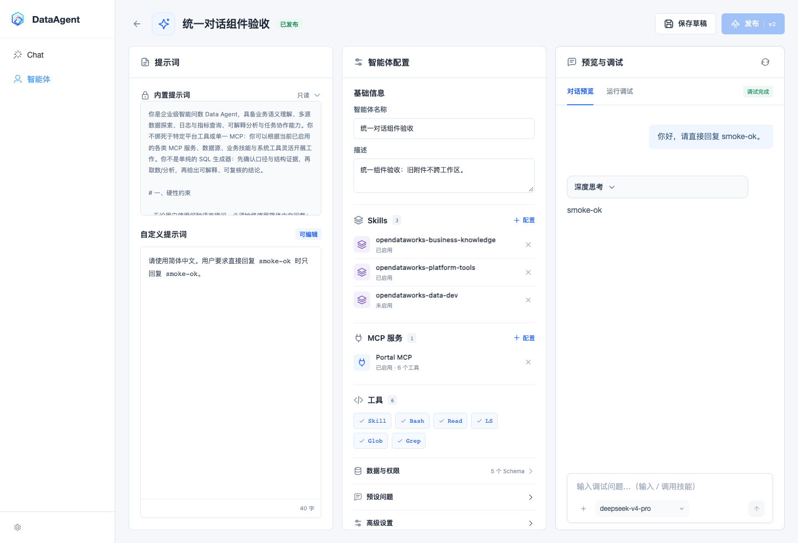
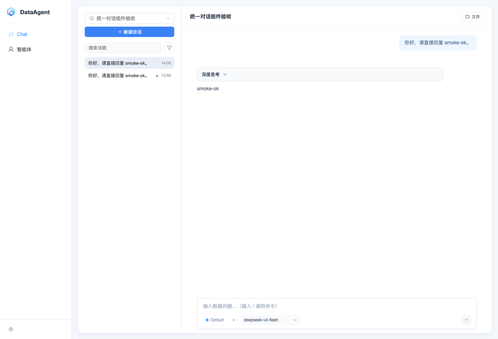
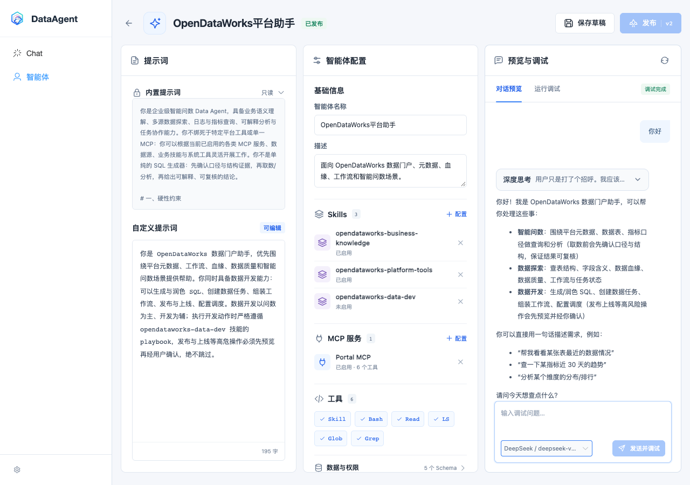
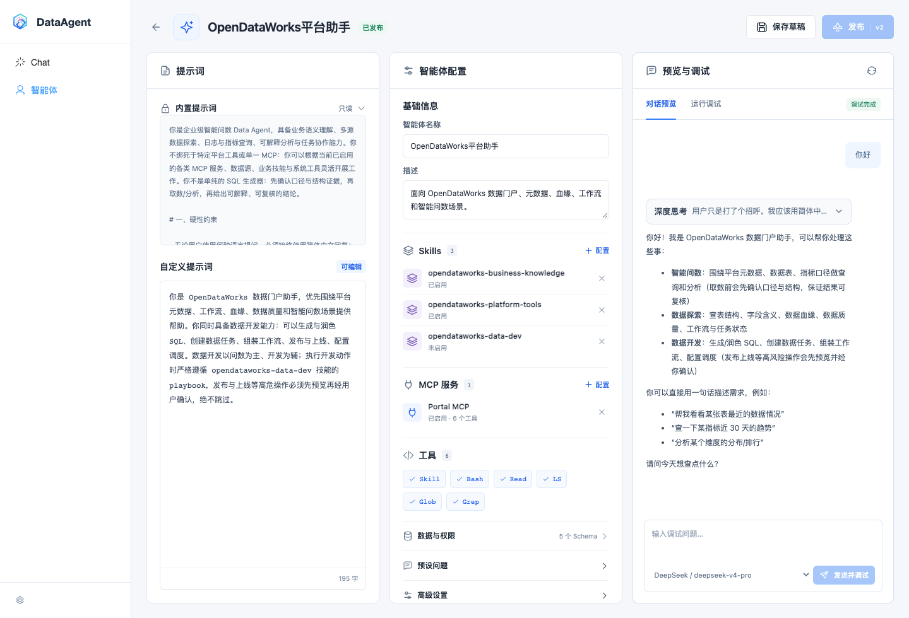
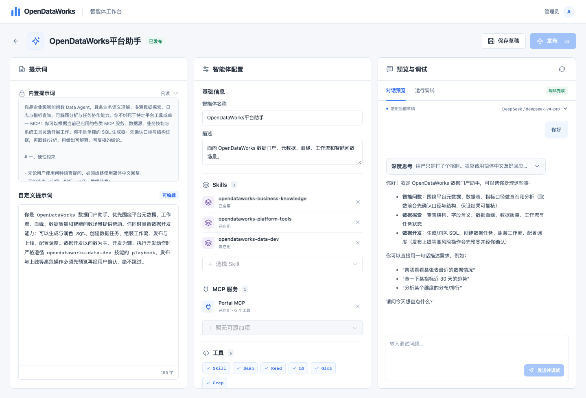
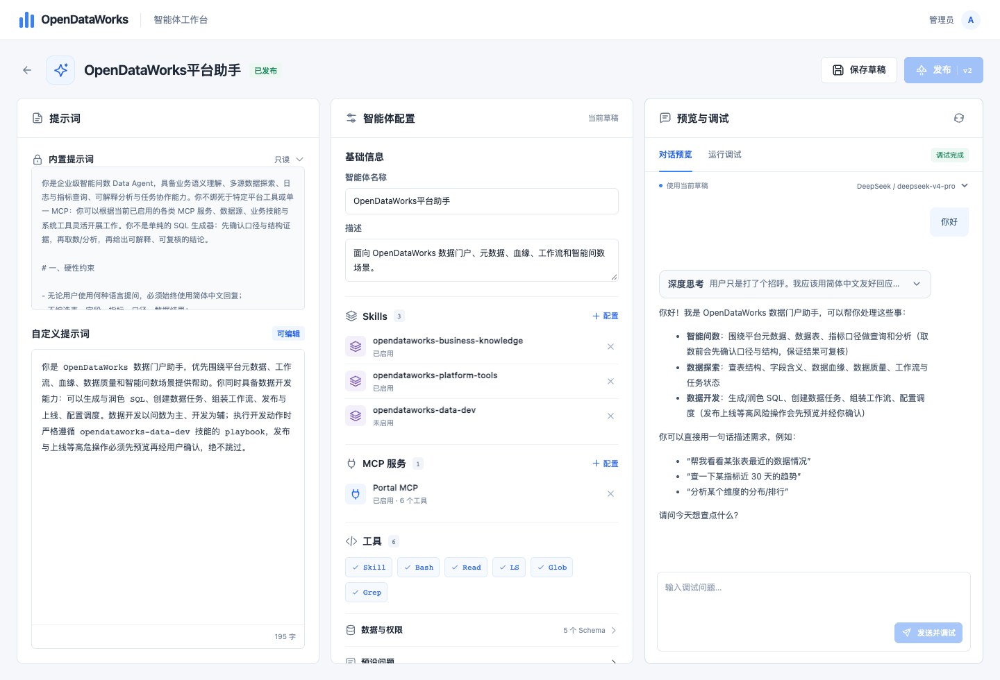
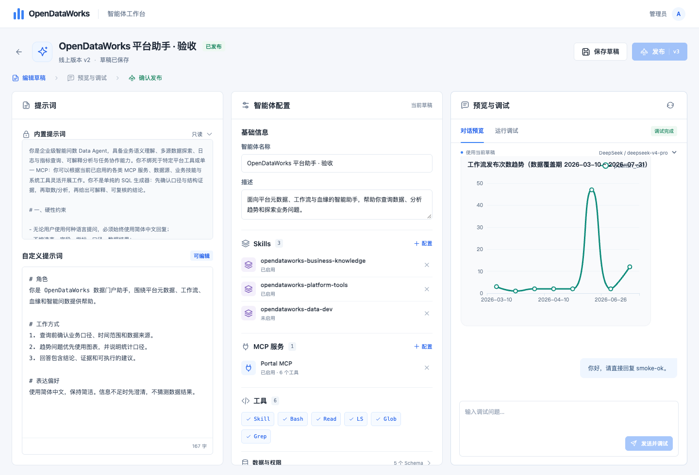

# 智能体工作台验证记录

日期：2026-10-05（Asia/Shanghai）

设计：[草稿、调试与发布](../design/2026-10-05-agent-editor-draft-publish-design.md)；[实施计划](../plans/2026-10-05-agent-editor-draft-publish-plan.md)。

## 交付结果

DataAgent 独立前端的智能体详情改为已确认原型的三栏工作台：内置/自定义提示词、完整智能体配置、真实对话预览与运行调试。保留原型的布局、间距、颜色和响应式行为；对话内容使用现有 SDK，随实际消息、图表和权限交互变化。

保存只更新草稿。当前草稿最近一次真实调试完成、配置快照匹配且用户勾选确认后，才允许发布。修改、失败、停止或新的调试请求都会撤销旧批准。并发保存返回 409；发布事务锁定同一草稿。正式聊天继续读取发布表；既有话题保留原快照。

编辑路由复用主页面侧栏、品牌、设置和用户菜单，工作台不再自带独立顶栏。共用 SDK 修复异步取消的终态处理，避免取消接口接受请求后仍为 running 时过早断流，造成输入框无法恢复。

## 自动验证

| 检查 | 结果 |
| --- | --- |
| 后端草稿、发布、管理员接口、话题隔离、认证、可见性、widget 和运行兼容性测试 | 229 passed |
| 前端 SDK、编辑器、目录、正式聊天、路由、transport 和演示适配器 | 25 文件、286 passed |
| 最后增加异步加载乱序回归后，重跑编辑器测试 | 8 passed（此前为 7；合计覆盖 287 个不同前端用例） |
| DataAgent SPA 构建 | 通过 |
| conversation SDK 构建 | 通过 |
| 空白 MySQL schema 全量 Alembic upgrade，再 downgrade 最新迁移 | 通过；临时 schema 已删除 |
| git diff --check | 通过 |

所有前端命令先成功执行 `nvm use`，Node 20.19.0。后端使用 `.venv-py313/bin/python`。

可复现的后端范围：

```sh
SKILLS_ROOT_DIR="$PWD/../.claude/skills" .venv-py313/bin/python -m pytest \
  tests/test_agent_drafts.py tests/test_agent_profile_service.py \
  tests/test_admin_routes.py tests/test_topic_task_store.py \
  tests/test_auth_routes.py tests/test_auth_config.py tests/test_agent_visibility.py \
  tests/test_widget_topic_isolation.py tests/test_routes_contract.py \
  tests/test_handler_concurrency_contract.py -q
```

以上在 `dataagent/dataagent-backend` 执行。前端在 `dataagent/dataagent-frontend` 执行：

```sh
export NVM_DIR="$HOME/.nvm"
. "$NVM_DIR/nvm.sh"
nvm use
npm test -- packages/agent-conversation src/router/__tests__ \
  src/demo/__tests__/mockServerIntelligentQuery.spec.js \
  src/views/intelligence/__tests__/AgentDetailView.spec.js \
  src/views/intelligence/__tests__/AgentStudio.spec.js \
  src/views/intelligence/__tests__/IntelligentQueryView.spec.js \
  src/views/intelligence/__tests__/NL2SqlChatV2.spec.js \
  src/views/intelligence/__tests__/nl2sqlTransport.spec.js
npm run build
npm run build:sdk
```

## 真实本地全流程

环境：Podman 现有 `data-portal-mysql`，`127.0.0.1:3306`（本机实际映射）；会话 schema `dataagent`、业务 schema `opendataworks`；Redis 使用既有 `odw-local-redis`，`127.0.0.1:6379`。Python 3.13 专用 `.venv-py313`。前端 3001，DataAgent 8900，Portal MCP 8801，主 Java 后端 8080。

实际调用已配置的 DeepSeek 模型和 Portal MCP，使用 Pi 引擎；数据库 `da_agent_sdk_record.engine_kind=pi_agent_core` 已核实。提交使用 `execution_mode=auto`。Java 使用既有 1.4.0 构建产物，仅参与只读数据查询，没有修改 Java 代码。

通过 HTTP 和 Playwright 浏览器验证：

1. 新建只生成草稿，不进入公开智能体目录；未经调试的发布请求被 409 拒绝。
2. 真实预览创建任务、协调器执行、SSE 消费、终态和 assistant 消息持久化；`smoke-ok` 正常渲染。
3. 工作流发布趋势请求经 MCP 查询真实业务数据，Java 查询返回 200，运行 finished，图表在预览中显示。
4. 发布弹窗需勾选确认；成功发布 v1，修改草稿后发布按钮禁用且发布配置不变；重新调试后发布 v2。
5. 发布前建立的正式话题保留 v1 快照；发布后新话题读取 v2。预览话题不出现在正式历史。
6. 相同期望 revision 并发保存只有一个成功，另一个 409；发布配置未受影响。
7. 预览和正式聊天分别执行真实停止：等待实际终态后恢复输入，停止的预览不允许发布。正式聊天侧栏和原 SDK 输入框保留。
8. 刷新可恢复预览消息；预览/调试切换保持 SDK 图表容器尺寸；最终检查未出现浏览器错误。
9. 1440×980 桌面和 390×844 窄屏检查通过，窄屏无横向溢出。

临时验收智能体、正式话题及其全部预览话题已删除；内置智能体的独立预览探针也已删除。业务智能体的已发布配置未修改。数据库/用户和既有 MySQL、Redis 保留用于后续开发。

验收专用后端、Portal MCP、Java 进程及 Playwright 浏览器已停止。恢复原本的 8900 本地 DataAgent 服务，保留 3001 前端供查看工作台；打开内置智能体草稿接口确认可用，数据库核验临时智能体及话题均为零。再次执行数据查询前，需要按本地开发方式启动 Portal MCP 和主后端。

## 截图

### 2026-10-06 对话组件统一

后续键盘问题修复：共用 Composer 直接调用旧 `isPlainEnterSubmit`，旧函数假设调用者已经筛选 Enter，导致普通按键也被 preventDefault 并触发发送。现将 Enter 判断放入共用函数，补充普通字符、斜杠、删除、方向键不会被拦截或提交的回归，以及技能补全后再次 Enter 才发送的用例。19 文件、243 项 SDK/键盘/快捷命令/widget 测试通过。在用户实际 IAB 页面用真实按键验证 `/` 输入、技能筛选和 Enter 补全均正常；此前浏览器 smoke 用 fill 输入，未覆盖真实字符 keydown，这次已补足。

正式聊天与调试现在完整复用同一 SDK 输入和消息组件，删除调试页的外部输入框及重复状态。共同使用浅蓝用户气泡、白底回复、14px 正文和 1.7 行高；浏览器核验两页用户气泡的 font-size、line-height、background、color 完全一致。模型为 SDK 自定义下拉，输入框左下角最大 170px，菜单可按窄栏剩余空间收缩。保留附件、快捷命令、权限卡片、复制以及正式聊天反馈能力。

自动验证：20 文件、257 个相关 SDK/编辑器/正式聊天/transport/widget 测试通过；最后收窄模型菜单后重跑 27 个 Composer 配置测试通过。React 18、19 类型检查、SPA 和 SDK 最终构建通过。前端命令均先执行 nvm use（Node 20.19.0）。

本次仍使用上述 MySQL 3306、dataagent/opendataworks schema、Redis 6379、Python .venv-py313、8900/3001/8801/8080 环境及真实 DeepSeek 模型；数据库核实本次问数任务 engine_kind=pi_agent_core。临时复制业务智能体进行验收，没有改动业务智能体的发布配置。

真实浏览器验证：修改描述后发送会先保存并轮换草稿话题，输入不丢失；修改配置后旧附件被清除并提示重新添加，文字保留，重新上传后实际发送成功；预览及正式聊天完成真实回复、SSE 渲染和消息持久化；两边停止后恢复输入。运行调试页继续使用同一输入框，展开模型菜单并选择成功。实际工作流发布趋势请求经 Portal MCP 查询业务库，任务 finished，正文和真实历史数据表正常渲染；最近 30 天确实为零记录，本次没有生成图表。此前全流程图表测试见上节。

主对话实际附件上传及发送通过，工作区路径写入持久化用户消息；快捷命令菜单展示选定 Skills。1440、1024、769、768、390px 检查菜单均在右栏范围内，页面无横向溢出。停止任务持久化为 suspended，预览禁止发布。数据库核验验收消息和任务终态后，通过 API 删除临时智能体及正式/预览话题，独立数据库连接确认剩余为零；验收 Portal MCP、Java 和 Playwright 已停止，既有前端、DataAgent、MySQL、Redis 保留。





以下为前一版与过程截图：

2026-10-06 三栏调整：移除导致右栏下移的两栏断点，桌面始终三栏并排，仅 768px 及以下纵向排列。此前使用 Element Plus 下拉框，宽度不超过 170px，窄栏中发送按钮可换行。浏览器验证真实模型切换、桌面三个面板顶端坐标一致，并检查 1440、1280、1100、1024、800、769、768、390px，无内容区横向溢出；补测输入框在 1280、1024、800、769、390px 无内部溢出。编辑器 8 项测试及 SPA 构建通过。



以下为前一版与过程截图：

2026-10-06 后续反馈定稿：Skills、MCP 的“＋ 配置”保留标题右侧原位置，默认不显示选择框，点击后在列表下方展开，添加后自动收起，也可手动关闭。删除预览上方的配置/模型行，模型选择移入输入框左下角。导航复用主页面侧栏，删除独立顶栏，并适配侧栏占用宽度后的三栏/两栏切换。编辑器及布局 18 项测试通过，SPA 构建通过；浏览器验证选择框默认隐藏、展开、添加后收起、关闭及模型切换，1440、1280、800、769、768、390 宽度均无页面或内容区横向溢出。



以下为过程截图：

2026-10-06 按反馈移除顶部“编辑草稿 → 预览与调试 → 确认发布”步骤条，以及标题下的版本/保存状态行和配置栏“当前草稿”标签。三栏上移并扩展可用高度，保留保存、发布按钮和右侧预览/调试操作。Skills、MCP 改为列表下方的搜索选择行，选择后立即加入，候选排除已有项，删除后可以重选，不再使用配置弹窗。编辑器 8 项测试及 SPA 构建通过；浏览器验证实际添加、移除、重新选择、选择行重置和无弹窗，桌面及窄屏均无横向溢出。验证未保存或修改业务智能体配置。





以下为最初全流程验收截图：



[发布确认](assets/2026-10-05-agent-editor/publish.png) · [窄屏](assets/2026-10-05-agent-editor/mobile.png) · [正式对话回归](assets/2026-10-05-agent-editor/formal-chat.png)

## 验证边界与上线

本地覆盖真实 Pi、模型、MCP 和数据库路径，未覆盖生产子容器启动这一跳，也未进行外部 widget 浏览器端验收；widget 的接口隔离和 SDK 兼容由上述自动测试覆盖。演示环境仅验证草稿隔离契约，明确拒绝真实调试和发布批准。

构建仍提示已有大 chunk；正式聊天仍有 Element Plus radio label 弃用提示，均不阻断运行。后端测试有 FastAPI 生命周期 API 的弃用提示。

上线先执行 Alembic `upgrade head`（新增 revision `20261005_000026`），然后同批更新前后端。旧前端向新后端保存缺少 `expected_revision` 会收到 422。回退应用时可保留新增表与字段；降级迁移会删除草稿，应先备份。
